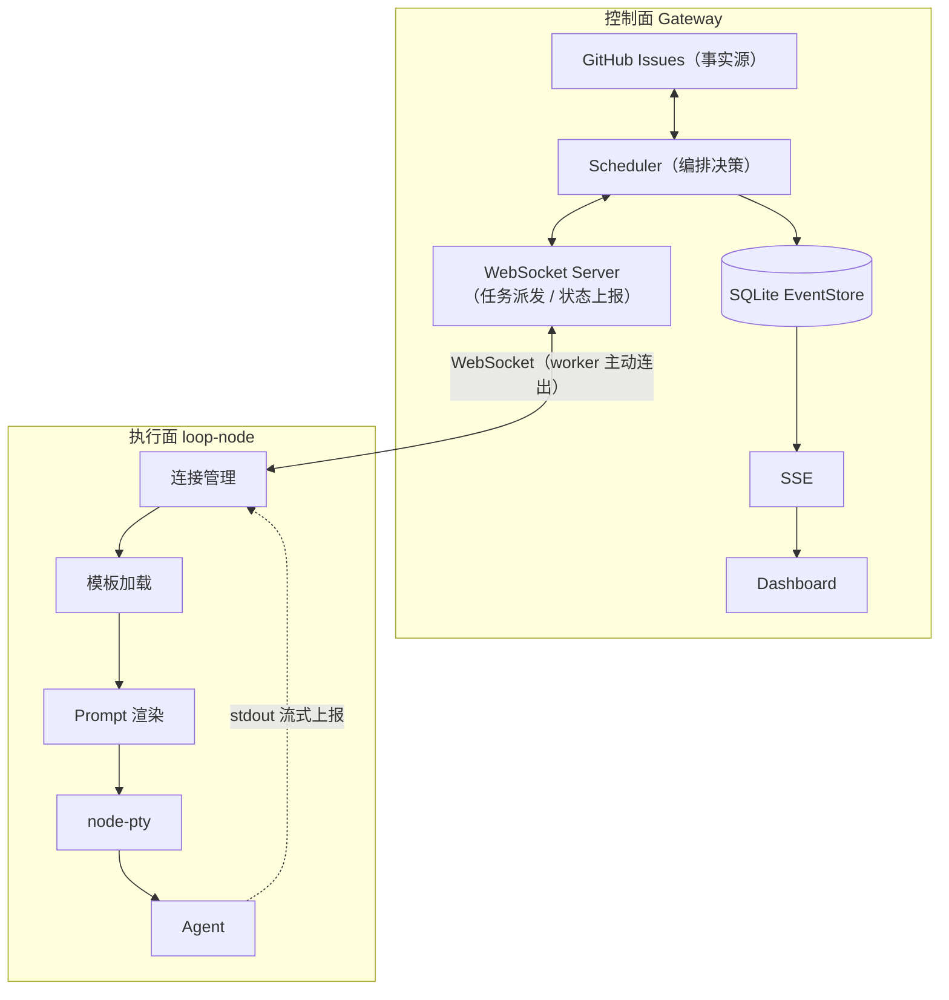

# Harness MVP

用 GitHub Issues 作为流程事实源、Gateway + loop-node + PTY + SSE + SQLite
事件流串起来的 Agent 编排最小复现版。

**开箱即用**：默认 mock 模式，不需要 GitHub token，不需要真实 Agent CLI。

## 目录结构

```txt
harness-mvp/
├── README.md
├── package.json
├── tsconfig.base.json
├── .env.example
├── .gitignore
├── packages/
│   ├── shared/          # 协议定义（事件、WebSocket 消息）
│   ├── gateway/         # 控制面
│   ├── loop-node/       # 执行面（PTY runner）
│   └── dashboard/       # SSE 实时看板
├── templates/           # 节点模板（业务与引擎分离）
│   ├── plan.md
│   ├── code.md
│   └── test.md
└── scripts/
    └── mock-agent.mjs   # 无需真实 Agent CLI 的模拟器
```

## 架构



<br />

三个分离：

1. **流程状态 vs 运行时状态**：Issue 标签是流程状态，Gateway 只存 runId / 事件流
2. **控制面 vs 执行面**：Gateway 决定「做什么」，loop-node 决定「怎么做」。两者不共享内存、不共享数据库。
3. **业务模板 vs 通用引擎**：节点逻辑写在 `templates/*.md`，引擎只负责加载、渲染、执行。

把 GitHub 换成 Meego、Jira 或 Linear，只需实现 GithubClient。
把 mock agent 换成 Claude Code / Codex / Trae-cli，只需设置 AGENT_CMD。
架构本身不变。

## Gateway：核心设计

Gateway 是单进程控制面，内部只有一条主链路：
`Scheduler 轮询 → 派发 → Worker 回报 → 回写 GitHub → 事件落库 → SSE 广播`。

### 1. GitHub Issues 是唯一事实源，轮询驱动状态机

- Scheduler 每 `GITHUB_POLL_MS`（默认 5s）拉一次 open issues，从 `node:xxx`
  标签推导当前节点（`detectNode`）。Issue 标签是**流程状态**，Gateway 内存里只有
  worker 连接和 run 锁等**运行时状态**，二者严格分离。
- **新 issue 两段式接入**：第一次 tick 只贴 `node:plan` 标签就返回，下一轮轮询才真正派发。
  保证标签先持久化到 GitHub、再执行任务——Gateway 随时崩溃，流程进度都不会丢。
- 取舍：选轮询而不是 Webhook，换来免公网回调、本地/内网可跑、重启自愈；
  代价是 5s 级调度延迟和持续的 API 配额消耗，且 Scheduler 只能单实例。

### 2. 事件溯源：append-only SQLite + 全局单调 seq

- 所有状态变化都是不可变事件（四类 source：`github` / `openapi` / `harness` / `worker`），
  只 append、不 update/delete。Dashboard 只是事件流的只读投影。
- 写入顺序固定为**先落库后广播**（`store.append` → `EventBus.emitEvent`），
  SSE 订阅者收到的事件一定已持久化。
- `seq` 全局单调递增，SSE 断线重连时带 `Last-Event-ID: <seq>` 即可从
  `listAfter(seq)` 精确续传，连接内还有 15s ping 保活。
- SQLite 开 WAL、单文件、零运维；代价是单实例绑定，无法多个 Gateway 共享同一份状态。

### 3. 派发锁与投递语义：at-least-once

- `runsByIssue` / `runsByRunId` 两个内存 Map 构成「每个 issue 一把锁」，
  tick 遇到在跑的 issue 直接跳过。选 worker 的策略极简：第一个 `!busy`
  且 WebSocket 处于 OPEN 的连接（不做公平/加权调度）。
- **锁必须在 GitHub 回写（评论 + 推进标签）成功后才释放**：评论/打标期间轮询仍会看到
  旧标签，提前释放会让同一节点被重复派发。
- 回写失败、worker 断线（`worker_lost`）、Gateway 重启：统一靠「保留 issue 标签 +
  释放锁」兜底，下一轮轮询按标签重跑该节点。因此投递语义是 **at-least-once**，
  节点模板/Agent 需自行幂等；「评论成功但打标失败」的窗口内可能产生重复评论。
- Gateway 重启后迟到的 `run.result` 在 Map 中找不到 run，会被直接丢弃。
- 取舍：不引入分布式锁/租约/外部队列，零依赖成立的前提是 Gateway 单实例。

### 4. 通信面按形态选型：Worker 走 WS，看板走 SSE

- Worker **主动连出** `/ws`（NAT/内网友好，Gateway 不需要反连），
  `hello` + `WORKER_TOKEN` 握手（5s 超时，token 错误回 4003 并关闭），
  之后靠 heartbeat 上报负载、progress 回报输出。执行面可多机水平扩展。
- Dashboard 是纯只读消费方，用 SSE 单向流：HTTP 原生、浏览器自动重连、
  原生支持 `Last-Event-ID`。没有为了统一而上 WebSocket。
- 每条 progress chunk 入库时截断到 800 字符，避免高频 stdout 撑爆事件表。

### 5. GithubClient 接口抽象 + 谨慎的失败重试

- 对外只有 `listIssues / addComment / setLabels / closeIssue` 四个方法，
  mock / real 双实现由 `GITHUB_MODE` 切换；接 Meego、Jira、Linear 只需补一个实现。
- 重试策略按幂等性区分：GET 遇到 5xx/429 指数退避重试（最多 4 次）；
  POST/PATCH 已确认到达服务器就**不**自动重试（防止重复评论）；
  连接级失败（DNS/TLS 中断、ECONNRESET，未确认到达）任何方法都可重试。
- `setLabels` 只替换 `node:` 前缀的 harness 标签，issue 上的人工标签原样保留。

### 6. 并发控制：单线程上的「无锁临界区」

Gateway 没有 mutex、信号量或任务队列，并发安全建立在三条事实之上：
**Node 单线程事件循环、临界区不跨 `await`、GitHub 标签在进程外兜底**。

#### 三道并发闸门

| 闸门 | 载体 | 作用域 | 被越过时的兜底 |
| --- | --- | --- | --- |
| `ticking` 标志位 | Scheduler 内存 boolean | 防止两个 tick 重叠 | try/finally 保证复位，`setTimeout` 自链根本不会叠 tick |
| `worker.busy` 容量位 | 连接对象 boolean | 每个 worker 并发度恒为 1 | 无空闲 worker 不排队，本 issue 留到下轮 tick 再试 |
| `runsByIssue` 去重锁 | 内存 Map（issue 号→Run） | 防止同一 issue 重复派发 | 进程崩溃/断线后锁失，按 GitHub 标签重放 |

#### 临界区设计：检查与占位在同一个同步块完成

`dispatch()` 中「选 worker（`pickWorker`）→ `runsByIssue.set` →
`runsByRunId.set` → `busy=true`」全部同步执行，先于 `socket.send` 和事件广播，
中间没有任何 `await`。因此「issue 已占位 + worker 已占用」对随后任意时刻的
tick、WS 消息、healthCheck 立刻可见，不存在「检查时空闲、await 回来已被占」的
交错窗口。JS 单线程只在 `await` 处让出，临界区无 await 即等价于原子操作。

#### 两级状态，两段释放：容量先放、去重锁后放

`busy` 与 issue 锁约束的是不同维度，释放时机刻意不同：

1. **worker 容量**：WS 层收到 `run.result` 的同一个同步块立即
   `busy=false`（[ws.ts 89-91](packages/gateway/src/ws.ts#L89-L91)），
   worker 马上可以接**别的 issue**；
2. **issue 去重锁**：必须等 `onRunResult` 里 GitHub 评论 + 推进标签全部成功后，
   才在同一函数末尾释放（[scheduler.ts 221-226](packages/gateway/src/scheduler.ts#L221-L226)）。
   回写耗时数秒，期间 tick 照跑，但该 issue 因在 Map 中被跳过，不会看到旧标签重复派发。

Gateway **不设内部队列**：派发时刻没有空闲 worker，issue 既不移除标签也不入队，
直接跳过，5s 后下轮轮询重新评估。队列实质由「GitHub 未完成的 issue 列表」承担。

#### 锁持有者死亡回收：ping / stale / terminate

执行 PTY 的 worker 可能进程假死或 TCP 半开：

- Scheduler 每 `WORKER_PING_MS`（默认 15s）给每个在线 worker 发应用层 `ping`；
  worker 的任意消息（heartbeat 或 progress）都会刷新 `lastSeen`；
- 超过 `WORKER_STALE_MS`（默认 45s）没消息即判定死亡：先记录 `worker.stale`
  事件，再 `socket.terminate()`；随后的 `close` 回调走 `unregisterWorker`
  → `releaseRun('worker_lost')` 同步摘除两个 Map 中的锁；
- 下轮轮询看到 issue 仍是旧标签，重新派发该节点。
  锁随连接生命周期绑定，死亡连接不会把 issue 永久锁死。

#### 存储与广播侧的并发保证

- **seq 原子性**：`better-sqlite3` 是同步驱动，`append()` 里 `++seq` 与 INSERT
  在同一个同步调用内完成，多个异步事件生产方不可能交错出重号——这是刻意选择
  同步驱动的原因。事件广播固定「先落库后广播」，订阅者收到的事件一定已入库。
- **WAL**：SSE 连接的历史重放、HTTP 查询与事件写入并发而不互斥。
- **SSE 连接建立无缺口**：`listAfter(lastId)` 历史回放与 `bus.onEvent` 订阅在
  [http.ts 52-58](packages/gateway/src/http.ts#L52-L58) 中是一段没有 `await`
  的同步代码；而生产侧 `append → emitEvent` 同样同步连续。两段同步代码在单线程
  下不可能交错，因此同一条事件不会「历史里有、live 又推一次」，也不会漏。
- **EventBus 同步扇出**：每条 SSE 连接一个 listener，断连即在 `req.close` 里
  `off()` 退订；`setMaxListeners(0)` 解除默认 10 连接上限。

#### 已知并发窗口与边界（诚实清单）

- **`busy` 双写窄窗**：gateway 发 `launch` 后，worker 在模板加载、prompt 落盘
  完成后才登记 `activeRuns`；若恰在此窗口收到 ping，heartbeat 回报 `load=0`
  会把 gateway 侧的 `busy` 覆写为 false，理论上同一 worker 可再接一个 run
  （issue 去重锁仍保证两个 run 一定是不同 issue）。15s 的 ping 间隔对毫秒级的
  launch 处理使窗口几乎不可命中；要彻底收敛，可让 `busy` 以 launch/result
  为唯一权威，heartbeat 只刷新 `lastSeen`。
- **回写途中 worker 断线**：`onRunResult` 持有 run 的本地引用继续 GitHub 回写，
  但锁可能已被 `worker_lost` 摘除——这正是 at-least-once 重派窗口，
  靠节点幂等消化。
- **优雅退出不等待在途回写**：`shutdown` 只停 timer、关连接，不等待数秒级的
  GitHub 回写完成；中途退出同样靠重启后标签重放收敛。
- **仅单 Gateway 实例成立**：`ticking`、内存 Map 都是进程内机制，没有选主、
  分布式锁或 fencing token；两个 Gateway 轮同一仓库会重复派发。

## loop-node（worker）：核心设计

loop-node 是无状态执行面：启动即连 Gateway，收 `launch` →
加载模板 → 渲染 prompt → 起 PTY 跑 Agent → 流式回报 → 退出码/超时定成败。

### 1. 主动外连、退避重连、自身无状态

- 不监听任何端口，`hello` 声明 `nodeId / agents / version`。
- **指数退避重连**：断连后 1s 起、每次翻倍、上限 30s；收到 `hello.ack`
  后立即重置回 1s。避免 Gateway 长时间宕机时的重连风暴。
- **token 被拒不退出**：收到 `hello.reject` 只记录日志，等待 close 事件带退避
  重试——修正 token 或 Gateway 重启后可自动恢复，不必人工拉起进程。
- **TCP 半开自检**：每 15s 巡检一次，若 45s 没收到 Gateway 任何消息
  （正常情况下 `ping` 每 15s 一个），判定物理链路已断且 close 不会到来，
  主动 `terminate()` 进入重连。
- **断连即孤儿化 + 强杀在跑 run**：连接关闭时所有在跑 agent 一律
  `SIGKILL`（`orphanAllRuns`）。因为 Gateway 侧已按 `worker_lost`
  释放锁，重连后可能有另一个 run 接手同一 issue，放任旧 agent 存活只会
  并发踩同一工作目录；孤儿 run 后续的退出事件也不再上报，重派完全由
  Gateway 按 GitHub 标签驱动（at-least-once）。
- **进程级异常兜底**：`unhandledRejection` / `uncaughtException` 只记录不退出，
  一次偶发错误不会拖垮长驻的执行节点。
- worker 不持久化任何任务状态。重连后是否有活干、干什么，完全由 Gateway
  轮询 issue 标签后重新决定，因此 worker 可以随意重启、扩容、杀进程。

### 2. PTY 优先，child_process 兜底

- 首选 `node-pty`（伪造成 `xterm-256color`、200×50 终端）：Claude Code / Codex /
  trae-cli 这类 CLI 会检测 TTY，非 TTY 下会关闭交互确认、彩色输出和基于本地
  transcript 的 resume 能力。
- 原生模块编译/加载失败时自动降级到 `spawn`：链路仍可用，但丢失全部 TTY 特性。
  这是「能跑」与「跑得像真实终端」之间的显式分层。
- **启动失败按失败 run 上报，不炸进程**：node-pty 的 spawn 失败（命令不存在等）
  同步抛出，由 `handleLaunch` 捕获后回 `run.result: failed`（agent 启动失败）；
  spawn 分支额外监听进程 `error` 事件（命令不存在 / 无执行权限），按退出码 127
  走正常失败分支，而不是升级成 `uncaughtException` 杀死整个 node。
- **退出事件恰好一次**：两条分支都有 `exited` 去重，超时 kill 与进程自然退出
  竞争时，`onExit` 也只会触发一次终态上报。

### 3. Agent CLI 最小契约：一个文件路径 + 一个退出码

对 Agent 只有三条硬约束：

1. 接收 **prompt 文件路径作为最后一个参数**；
2. 过程输出打到 stdout（逐 chunk 上报）；
3. 退出码 0 表示成功，非 0 即失败。

- 渲染后的 prompt **落盘**到 `workspace/<runId>/prompt.md`，而不是走 argv 或 stdin：
  长 prompt 无长度风险、事后可审计、Agent 的 resume 也能复用该文件。
- 每个 run 独占 `workspace/<runId>/` 工作目录，并注入
  `HARNESS_RUN_ID / HARNESS_NODE / HARNESS_WORK_ITEM` 环境变量。
- 换 Agent 只改 `AGENT_CMD`（参数取自 `AGENTS` 环境变量，按空白拆分）：
  默认 mock 模式下二者均未设置，回退到 `node scripts/mock-agent.mjs`；
  真实模式由 `scripts/dev-real.sh` 把 `AGENT_CMD` 指到
  `scripts/trae-prompt-runner.sh`，亦可换 Claude Code / Codex。
  注意：`.env.example` 中示例的 `AGENT_ARGS` 当前**不被代码读取**
  （[config.ts:33](packages/loop-node/src/config.ts#L33) 读的是 `AGENTS`），
  配置时以代码为准。
- **启动前各失败点都回失败结果**：模板加载失败、工作目录/prompt 落盘失败、
  agent 进程启动失败，都会直接回 `run.result: failed` 并附中文错误原因，
  不会让 launch 静默挂起或变成未处理异常。

### 4. 模板即业务，引擎不含业务

- 节点逻辑全部在 `templates/<node>.md`：YAML frontmatter 声明元信息，
  Markdown 正文是 prompt，`{{issue.title}}` / `{{issue.body}}` 占位符做纯字符串替换。
- 流水线顺序唯一以 Gateway 的 `PIPELINE`（默认 `plan,code,test`）为准；
  模板 frontmatter 里的 `next / inputs` 目前是**声明性元数据**，不参与调度，
  避免引擎和模板各持一份状态机导致分叉。

### 5. 流式上报、有界缓冲、超时与取消

- **逐 chunk 实时上报**：stdout 每收到一块立即发 `run.progress` 驱动看板；
  同时本地累积，终态随 `run.result` 一并回报。
- **输出有界、只留尾部**：累积超过 256KiB（`OUTPUT_MAX`）时截为尾部
  64KiB（`OUTPUT_KEEP`），防止超长会话撑爆 worker 内存或单个 WS 帧过大；
  Gateway 侧还有两层截断——每条 progress chunk 入库截 800 字符、写回 issue
  评论只取尾部 3000 字符。整条链路都以「尾部即结论」为前提。
- **双超时兜底**（均可设 0 禁用）：
  - 总时长 `RUN_TIMEOUT_MS`（默认 60min）：给失控循环设硬上限；
  - 空闲 `RUN_IDLE_TIMEOUT_MS`（默认连续 5min 无输出）：识别 agent 卡死；
    idle 计时器每收到一块输出就重置。
  - 触发超时先发默认终止信号，3s 后仍未退出则 `killGuard` 补 `SIGKILL`；
    该 run 以 `failed` 上报，错误信息区分「总时长超时」与「连续无输出」。
- **终态恰好一次**：`settled` 标志让「超时 kill → onExit」与「自然退出」
  竞争时只会发出一个 `run.result`；`orphaned` 标志保证断线后被强杀的 run
  其退出不再上报（Gateway 早已释放该 run）。
- **cancel 与优雅退出**：收到 `cancel` 清掉全部定时器后直接 `SIGKILL`；
  进程收到 `SIGINT/SIGTERM` 时同样强杀全部在跑 run、关连接后退出，
  不等待 agent 自行收尾——残留节点统一由 Gateway 按标签重派。
- 取舍：用固定大小的尾部缓冲代替全文留存，代价是丢失会话中段输出
  （而 Gateway 评论本来也只保留尾部）；不做输出分片上传或对象存储，
  需要完整 transcript 时应依赖 agent 自身的本地会话文件。

## 架构取舍一览

| 选择 | 放弃的方案 | 换来什么 / 代价 |
| --- | --- | --- |
| Issue 轮询 | Webhook 推送 | 免公网回调、本地可跑、标签自愈；5s 延迟、耗 API 配额 |
| Issue 标签即状态机 | DB 存流程状态 | 状态在外部平台、人工可直接干预；受标签一致性约束 |
| 内存 run 锁 | 分布式锁 / 租约 | 零依赖；仅限单 Gateway，靠 at-least-once 重放兜底 |
| 无锁临界区（单线程 + 同步 IO） | Mutex / 异步数据库驱动 | 无死锁、seq 天然有序、事件不重不漏；吞吐受单核约束，临界区必须无 `await` |
| 不设内部任务队列 | 调度队列 + 租约 | 无队列积压状态，崩溃即清零、靠 issue 列表重放；无空闲 worker 时要等下轮 5s 轮询 |
| SQLite 事件流 | Redis / PG / MQ | 单文件零运维、seq 天然支持 SSE 续传；不能多实例共享 |
| WS + SSE 分用 | 全 WebSocket | 按通信形态选型，浏览器侧零封装；维护两套协议 |
| PTY 跑 CLI | SDK / function-calling | Agent 能力零裁剪、CLI 可热替换；无结构化结果协议，靠退出码判成败 |
| 双超时强杀（60min 总时长 / 5min 空闲） | 协作式取消 / 检查点 | 失控循环和卡死都有硬兜底、实现简单；agent 无保存点，被杀后只能整节点重跑 |
| 输出有界尾部缓冲（256K→64K） | 全文留存 / 分片上传对象存储 | worker 内存与 WS 帧恒定有界；丢失中段输出，完整 transcript 依赖 agent 本地会话 |
| 线性 pipeline | DAG / 工作流引擎 | 几十行实现完整闭环；只支持线性节点 |
| prompt 落盘文件 | stdin / argv 传参 | 兼容任意 CLI、可审计、可 resume；多一次磁盘 IO |
| Worker 无状态 + 外连 | 中心反连 / 任务落 worker | worker 随意重启扩容、可放内网；断线即孤儿强杀在跑 run，由 Gateway 按标签整节点重派 |

## 快速开始

```bash
npm install
npm run dev

```

