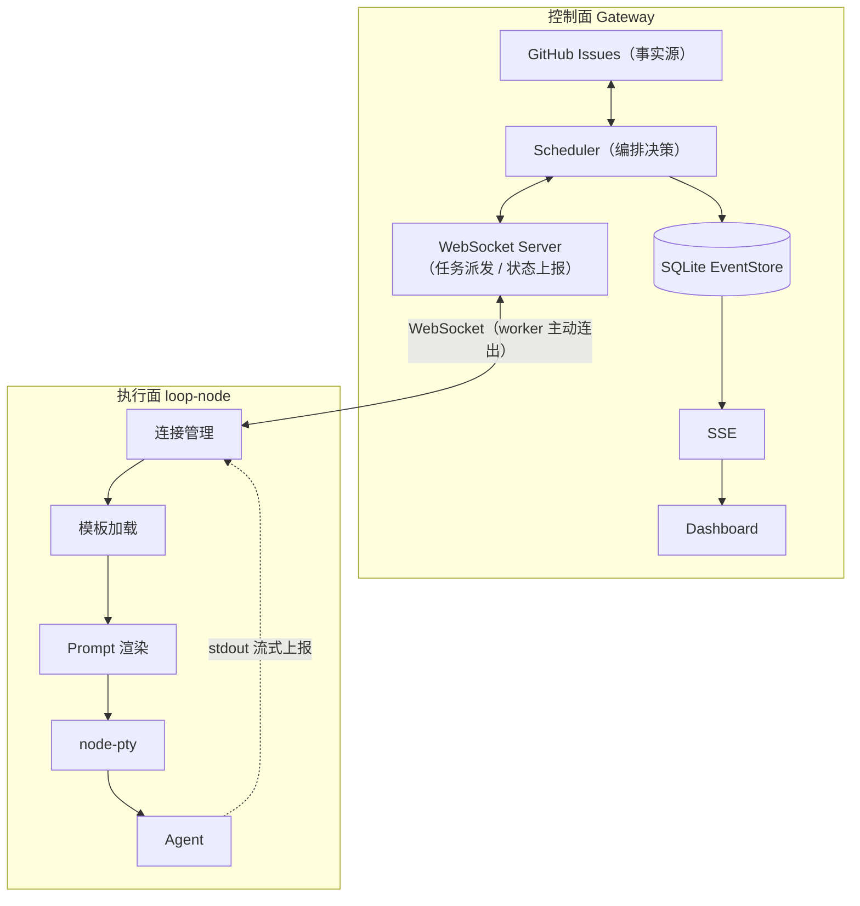

# Harness MVP

用 GitHub Issues 作为流程事实源、Gateway + loop-node + PTY + SSE + SQLite
事件流串起来的 Agent 编排最小复现版。

**开箱即用**：默认 mock 模式，不需要 GitHub token，不需要真实 Agent CLI。

## 目录结构

```txt
harness-mvp/
├── README.md
├── package.json
├── tsconfig.base.json
├── .env.example
├── .gitignore
├── packages/
│   ├── shared/          # 协议定义（事件、WebSocket 消息）
│   ├── gateway/         # 控制面
│   ├── loop-node/       # 执行面（PTY runner）
│   └── dashboard/       # SSE 实时看板
├── templates/           # 节点模板（业务与引擎分离）
│   ├── plan.md
│   ├── code.md
│   └── test.md
└── scripts/
    └── mock-agent.mjs   # 无需真实 Agent CLI 的模拟器
```

## 架构



<br />

三个分离：

1. **流程状态 vs 运行时状态**：Issue 标签是流程状态，Gateway 只存 runId / 事件流
2. **控制面 vs 执行面**：Gateway 决定「做什么」，loop-node 决定「怎么做」。两者不共享内存、不共享数据库。
3. **业务模板 vs 通用引擎**：节点逻辑写在 `templates/*.md`，引擎只负责加载、渲染、执行。

把 GitHub 换成 Meego、Jira 或 Linear，只需实现 GithubClient。
把 mock agent 换成 Claude Code / Codex，只需设置 AGENT_CMD。
架构本身不变。

## 快速开始

```bash
npm install
npm run dev

```

